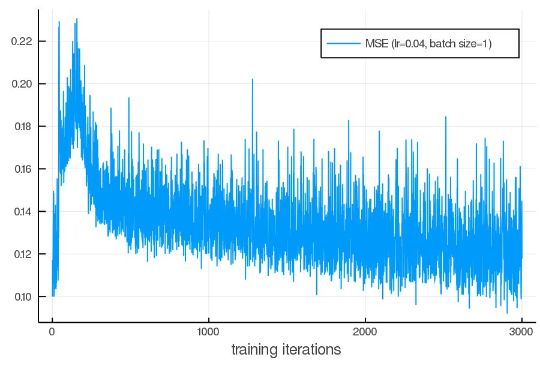

# spiking neural network
 A personal episode on trying to make networks that optimize 5 instrad of 2 distict parameter sets per layer using stochastic gradient descent

 * current problem: loss is 
 
